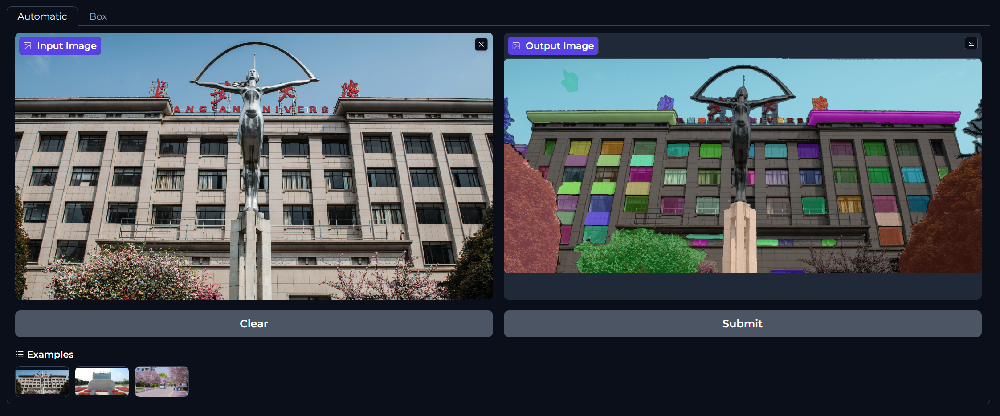
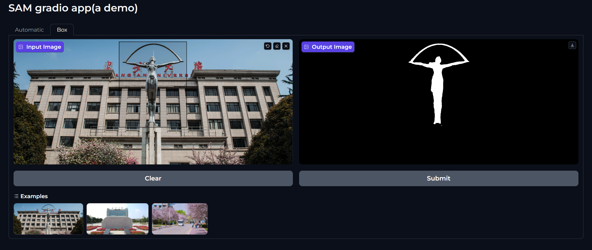

# segment-anything-gradio-ui
A segment anything gradio ui, supports automatic and prompt modes(point or box prompt). The prompt mode is based on [gradio-image-prompter](https://github.com/PhyscalX/gradio-image-prompter).

## auto mode

## prompt mode

## Installation
* Install **Segment Anything** following official [tutorial](https://github.com/facebookresearch/segment-anything?tab=readme-ov-file#installation)
* `pip install -r requirements`
* Download the SAM checkpoints from links: [ViT-H SAM model](https://dl.fbaipublicfiles.com/segment_anything/sam_vit_h_4b8939.pth), [ViT-L SAM model](https://dl.fbaipublicfiles.com/segment_anything/sam_vit_l_0b3195.pth),[ViT-B SAM model](https://dl.fbaipublicfiles.com/segment_anything/sam_vit_b_01ec64.pth). Put the checkpoints to directory `models`.

## TODO
- [ ] point prompts
- [ ] batch prompts
- [x] select differernt models
- [ ] show image with masks
- [x] add some examples
- [ ] support mobile SAM
  
**There's so much to do. :flushed: so busy :sob:**